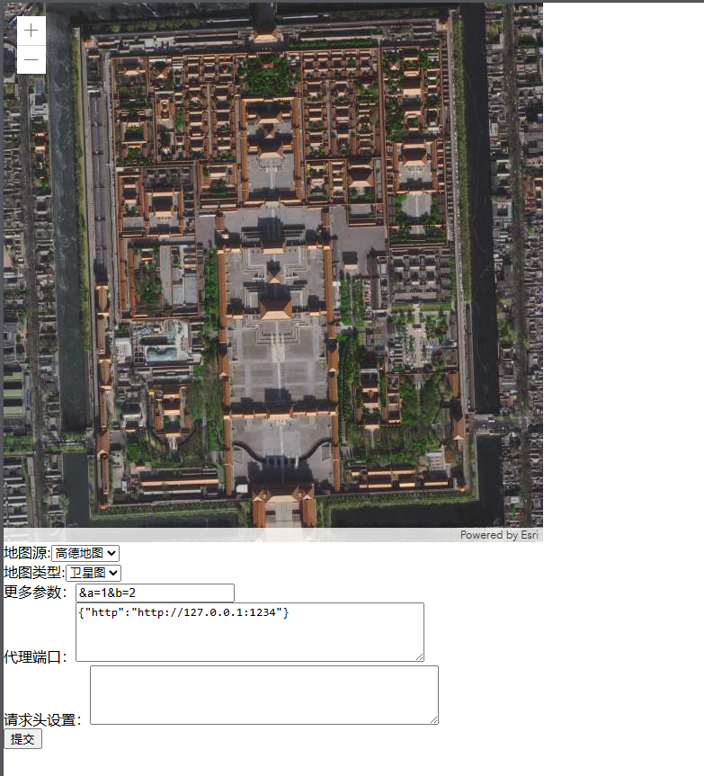

# flask-mapimg

#### 介绍
可自动缓存地图瓦片，保证项目下次加载更迅速
后端使用python flask
前端地图使用 arcgis.js

#### 软件架构
软件架构说明
前端使用：原生HTML，CSS，JavaScript，jQuery 3.6.0 地图控件：arcgis.js 4.22版本

后端使用 python 3.9.4 ，flask 3.0.3，requests 2.31.0 ,Flask-SocketIO 5.3.6

#### 安装教程
运行 app.py 文件即可，也可以从app.py文件中修改端口号，默认8087端口

#### 界面展示

个人博客链接：https://blog.csdn.net/qq_45062700?type=blog
